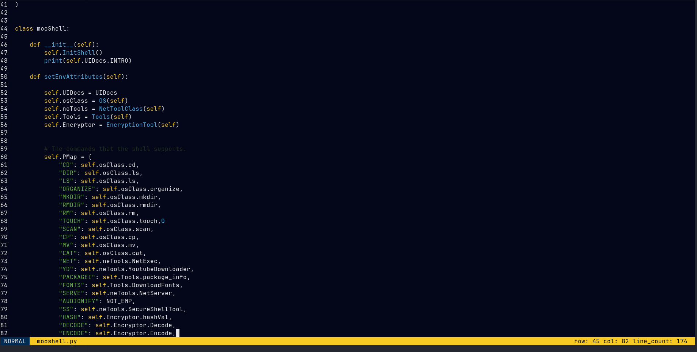

# Mi

Tui text editor made in ncurses

# Quick start

## Install ncurses using apt
```console
    $ sudo apt-get install libncurses5-dev libncursesw5-dev
```
## Compile

```console
    $ make
```

## Run
```console
    $ cd bin
    $ ./mi <file_path/dir_path>
```

## Keys and bindings.
- `EXIT`: F<2> (NOTE: does not saves the file.)
- `EXIT_AND_SAVE`: F<1> (NOTE: saves the file.))
- `SAVE`: ESC + w
- `FBROWSER_MODE`: ESC + .
- `FILE_MODES`: ESC + (n || v || i) -> (NORMAL, VISUAL, INSERT)
- `CUT`: ESC + v + SELECT TEXT + c
- `CUPY`: ESC + v + SELECT TEXT + yy
- `PASTE`: ESC + n + p

## Implemented Syntax Highlighting
- `Python`: was implemented. 
- `Js`: was implemented
- `C`: is still under developement.
- `Rust`: Not Yet
- `Go`: Not Yett

