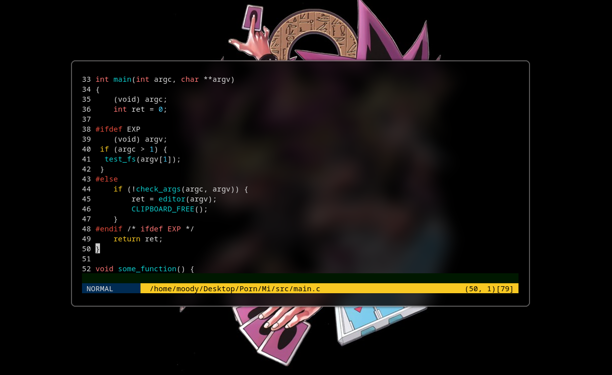
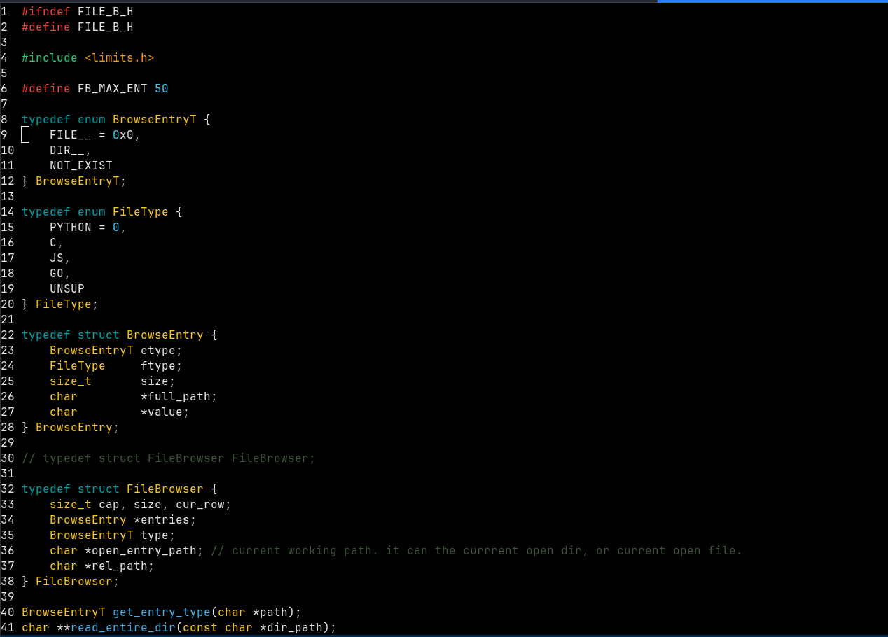
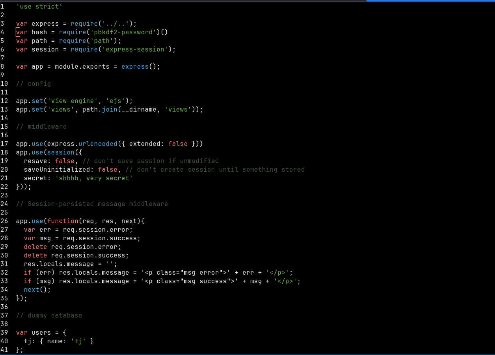
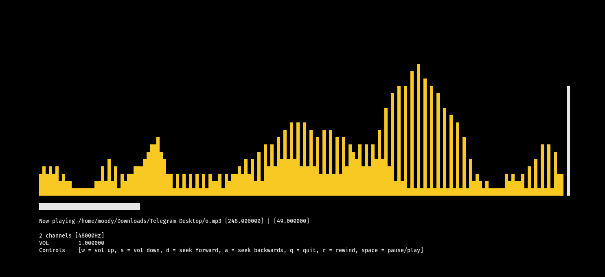
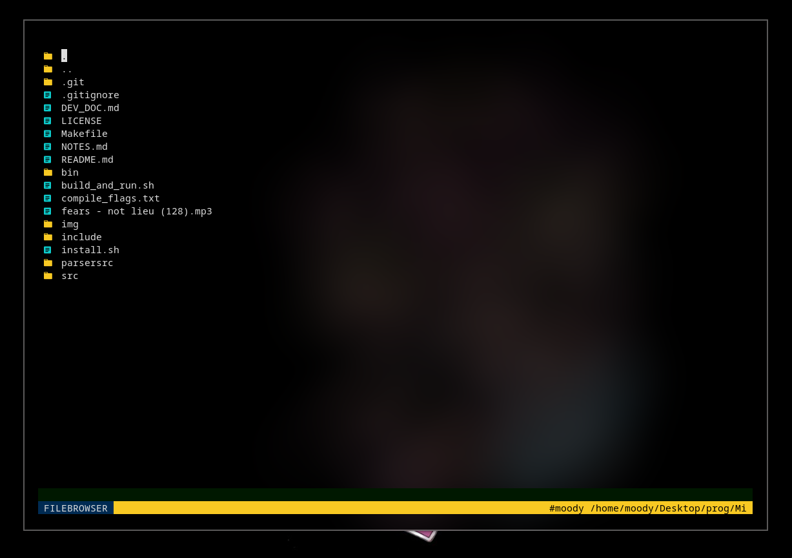

## WARNINGS!
- Please don't open very large files for now because there is no way to just effeciently load them, it just loads the whole file.
# Blade
Tui text editor made in ncurses, with an embdedded Music player, file browser, syntax Highlighting..
### KITTY

### PYTHON

### C

### JS

### Music player

### File Browser


# Quick start

## Install ncurses using apt
```console
    $ sudo apt-get install libncurses5-dev libncursesw5-dev
```
## Compile

```console
    $ make
```

## Run
```console
    $ cd bin
    $ ./mi <file_path/dir_path>
```

## Keys and bindings.
### Normal Editor Mode
- `EXIT`: ESC + : + q
- `EXIT_AND_SAVE`: ESC + : + x
- `SAVE`: ESC + : + w
- `FBROWSER_MODE`: ESC + .
- `FILE_EDITING_MODES`: ESC + (n || v || i) -> (NORMAL, VISUAL, INSERT)
- `CUT`: ESC + v + SELECT TEXT + c
- `CUT_LINE`: ESC + v + dd
- `COPY`: ESC + v + SELECT TEXT + y
- `COPY_LINE`: ESC + v + yy
- `PASTE`: ESC + n + p

### File Browser Mode
- `Open File`: Hit enter when the cursor is on top of the file/dir u want to open.
- `Select/Unselect`: `s`
- `Delete file/files`: hit `d` to delete one file or all Selected files.
- `move files/dirs`: when u finish selecting the files/dirs u want to move. place the cursor on the destination. then hit `m` and everything will be moved there.
- `copy files/`: same as move but now u hit `c` instead of `m`
- `Create files/directories`: Hit `a` then enter the name of the directory/directories you want to Create. FORMAT: dir1/ file1 dir2/ file2

## Implemented Syntax Highlighting
- `Python`: was implemented. 
- `Js`: was implemented
- `C`: is still under developement.
- `Rust`: Not Yet
- `Go`: Not Yett

## configuration
- The configuration is located in $HOME/.config/blade/blade.cfg
- it is generated automatically. so if u have anything in mind u want to change so go on and change the config.
- the config will be loaded automatically after u reopen the edior.
#### Possible customization for now:
- background
- foreground

# Next Up
[] review and fix bug.
[] Implementing a way to costumize the editor using a config file.
[] Implementing mode for language Highlighting
[] Implementing more commands to change stuff inside the editor.
[] Implementing smoother audio spect.
